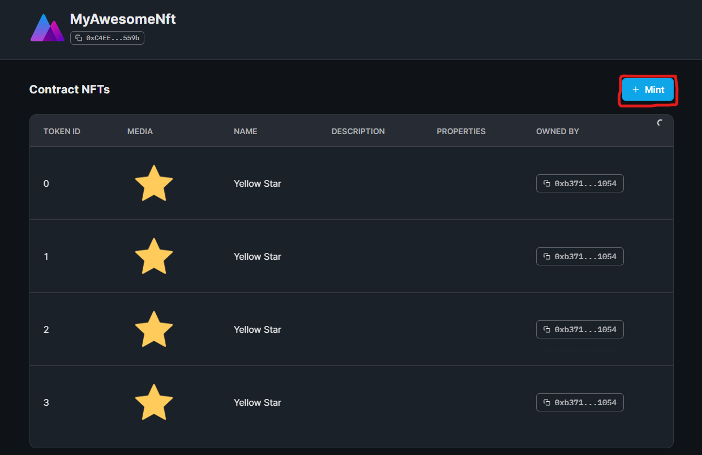

<!-- Banner Image -->


<h1 align='center'>Create an NFT collection with Solidity + thirdweb</h1>

<p align='center'>This template allows you to create an NFT Collection using Solidity and thirdweb.</p>

<br />

<b>Tools used in this template: </b>

- [Solidity](https://docs.soliditylang.org/en/v0.8.14/), [Hardhat](https://hardhat.org/), and [thirdweb deploy](https://portal.thirdweb.com/thirdweb-cli) to develop, test, and deploy our smart contract.

- thirdweb [Typescript](https://portal.thirdweb.com/typescript) and [React](https://portal.thirdweb.com/react) SDKs to interact with our smart contract

<br />

<b>Run the Application:</b>

To run the web application, change directories into `application`:

```bash
cd application
```

Then, run the development server:

```bash
npm install # Install dependencies first
npm run dev
```

Visit the application at [http://localhost:3000/](http://localhost:3000/).

<br />

<h2 align='center'>How to use this template</h2>

This template has two components:

1. The smart contract development in the [contract folder](./contract).
2. The web application in the [application folder](./application).

<h3>The NFT Collection Smart Contract</h3>

Let's explore how the [NFT Collection Smart Contract](./contract/contracts/MyAwesomeNft.sol) works in this template!

Our contract implements a base contract and also a contract extension::

1. The [`ERC721Base`](https://portal.thirdweb.com/solidity-sdk/base-contracts/erc-721/erc721base) base contract provides ERC-721A features.

2. The [`PermissionEnumerable`](https://portal.thirdweb.com/solidity-sdk/contract-extensions/permissions#permissions-enumerable) extension provides role-based restrictions on who can call specific functions.

As you can see in the contract definition:

```solidity
import "@thirdweb-dev/contracts/base/ERC721Base.sol";
import "@thirdweb-dev/contracts/extension/PermissionsEnumerable.sol";

contract MyAwesomeNft is ERC721Base, PermissionsEnumerable {

}
```

By implementing these contract extensions, we unlock powerful features on the [dashboard](https://thirdweb.com/dashboard) and the [SDK](https://portal.thirdweb.com/building-web3-apps/setting-up-the-sdk)!

Let's take a look at those now.

### On The Dashboard

When we deploy our contract we unlock the **NFTs** tab!

This allows us to easily view all of the NFTs that have been minted into our contract, who owns them, as well as their metadata.

Not only that, we get a **Mint** button to create _new_ NFTs into this contract!



This allows us to simply fill out a form with our NFT information, and mint that NFT on the dashboard, no code required. The metadata we upload is automatically uploaded and pinned to IPFS for us behind the scenes!

<div align='center'>


</div>

<br/>

### In the SDK

When we go to build out our web application, we can then mint an NFT in one line of code, thanks to this contract extension.

```jsx
await contract.nft.mint.to(walletAddress, nftMetadata);
```

This one line will upload our NFT metadata to IPFS, and then mint the NFT on the blockchain.

In the SDK, we can query all NFTs that have been minted, and get their metadata, and who they are owned by in one line:

```jsx
const nfts = await contract.nft.query.all();
```

<br/>

<h3>Deploying the contract</h3>

To deploy the `MyAwesomeNft` contract, change directories into the `contract` folder:

```bash
cd contract
```

Use [thirdweb deploy](https://portal.thirdweb.com/thirdweb-cli) to deploy the contract:

```bash
npx thirdweb deploy
```

Complete the deployment flow by clicking the generated link and using the thirdweb dashboard to choose your network and configuration.

## Using Your Contract

Inside the [home page](./application/pages/index.js) of the web application, connect to your smart contract inside the [`useContract`](https://portal.thirdweb.com/react/react.usecontract#usecontract-function) hook:

```jsx
// Get the smart contract by it's address
const { contract } = useContract("0x..."); // Your contract address here (from the thirdweb dashboard)
```

We configure the desired blockchain/network in the [`_app.js`](./application/pages/_app.js) file; be sure to change this to the network you deployed your contract to.

```jsx
// This is the chainId your dApp will work on.
const activeChainId = ChainId.Goerli;
```

Now we can easily call the functions of our [`NFT Collection contract`](./contract/contracts/MyAwesomeNft.sol) that we enabled by implementing thirdweb's contract extensions.

Here, we are using the [`useNFTs`](https://portal.thirdweb.com/react/react.usenfts) hook to view all the NFTs in the contract, and the [`useMintNFT`](https://portal.thirdweb.com/react/react.usemintnft) hook to mint a new NFT!

```jsx
// Read the NFTs from the contract
const { data: nfts, isLoading: loading } = useNFTs(contract?.nft);

// Function to mint a new NFT
const { mutate: mintNft, isLoading: minting } = useMintNFT(contract?.nft);
```

With the help of a few other useful hooks such as [`useAddress`](https://portal.thirdweb.com/react/react.useaddress) and [`useNetwork`](https://portal.thirdweb.com/react/react.usenetwork), we first make sure they are connected to the correct blockchain/network. Then, we allow them to mint an NFT when they click the `Mint NFT` button.

```jsx
async function mintAnNft() {
  // Ensure they have a connected wallet
  if (!address) {
    connectWithMetamask();
    return;
  }

  // Make sure they're on the right network
  if (isWrongNetwork) {
    switchNetwork(ChainId.Goerli);
    return;
  }

  mintNft(
    {
      metadata: {
        // Name of our NFT
        name: "Yellow Star",
        // Image of a gold star stored on IPFS
        image:
          "https://gateway.ipfscdn.io/ipfs/QmZbovNXznTHpYn2oqgCFQYP4ZCpKDquenv5rFCX8irseo/0.png",
      },
      // Send it to the connected wallet address
      to: address,
    },

    // When the transaction is confirmed, alert the user
    {
      onSuccess(data) {
        alert(`🚀 Successfully Minted NFT!`);
      },
    }
  );
}
```

### Connecting to user wallets

To perform a "write" operation (a transaction on the blockchain), we need to have a connected wallet, so we can use their **signer** to sign the transaction.

To connect a user's wallet, we use one of thirdweb's [wallet connection hooks](https://portal.thirdweb.com/react/category/wallet-connection). The SDK automatically detects the connected wallet and uses it to sign transactions. This works because our application is wrapped in the [`ThirdwebProvider`](https://portal.thirdweb.com/react/react.thirdwebprovider), as seen in the [`_app.js`](./application/pages/_app.js) file.

```jsx
const address = useAddress();
const connectWithMetamask = useMetamask();
```

## Join our Discord!

For any questions, suggestions, join our Discord at [https://discord.gg/thirdweb](https://discord.gg/thirdweb).
