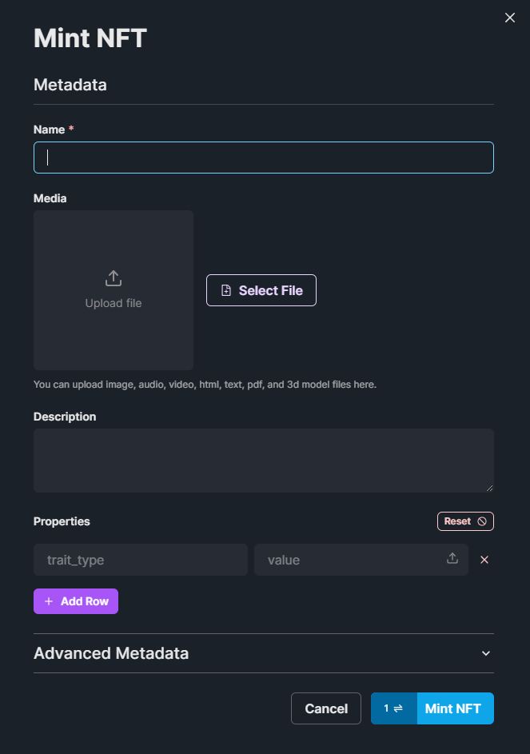

<!-- Banner Image -->


<h1 align='center'>Create an NFT collection with Solidity + thirdweb</h1>

<p align='center'>This template allows you to create an NFT Collection using Solidity and thirdweb.

<br />

<b>Tools used in this template: </b>

- [Solidity](https://docs.soliditylang.org/en/v0.8.14/), [Hardhat](https://hardhat.org/), and [thirdweb deploy](https://portal.thirdweb.com/thirdweb-deploy) to develop, test, and deploy our smart contract.

- thirdweb [Typescript](https://portal.thirdweb.com/typescript) and [React](https://portal.thirdweb.com/react) SDKs to interact with our smart contract

<br />

<b>Run the Application:</b>

To run the web application, change directories into `application`:

```bash
cd application
```

Then, run the development server:

```bash
npm run dev
```

Visit the application at [http://localhost:3000/](http://localhost:3000/).

<br />

<h2 align='center'>How to use this template</h2>

This template has two components:

1. The smart contract development in the [contract folder](./contract).
2. The web application in the [application folder](./application).

<h3>The NFT Collection Smart Contract</h3>

Let's explore how the [NFT Collection Smart Contract](./contract/contracts/MyAwesomeNft.sol) works in this template!

Our contract implements three other contracts/interfaces:

1. `ERC721URIStorage`
2. `IMintableERC721`
3. `IERC721Supply`

As you can see in the contract definition:

```solidity
contract MyAwesomeNft is ERC721URIStorage, IMintableERC721, IERC721Supply {

}
```

<h4>ERC721URIStorage</h4>

This contract comes from [OpenZeppelin](https://docs.openzeppelin.com/contracts/4.x/erc721#constructing_an_erc721_token_contract) and is an implementation of ERC-721 NFT standard that comes with metadata about each token, by using the `_setTokenURI` function.

This means, that inside our `mintTo` function (whenever a new NFT is created), we can set the metadata of the token, so that each NFT can have a name, description, image, and properties.

<h4>IMintableERC721</h4>

This is one of [thirdweb's contract extensions](https://portal.thirdweb.com/thirdweb-deploy/contract-extensions/erc721#erc721mintable), and by implementing it, we get two awesome features:

**1. The Mint button on the thirdweb dashboard**

When we deploy our contract, we'll see this button:


Then we can simply fill out a form with our NFT information, and mint that NFT on the dashboard, no code required.



**2. The mint function in the thirdweb SDK**

When we go to build out our web application, we can then mint an NFT in one line of code, thanks to this interface.

```jsx
await contract.nft.mint.to(walletAddress, nftMetadata);
```

This one line will upload our NFT metadata to IPFS, and then mint the NFT on the blockchain.

<h4>IERC721Supply</h4>

This is another one of [thirdweb's contract extensions](https://portal.thirdweb.com/thirdweb-deploy/contract-extensions/erc721#erc721supply), and by implementing it, we again, get features on thirdweb's dashboard and thirdweb's SDK.

On the dashboard, it allows us to view all of the NFTs that have been minted so far, including their metadata and who they are owned by.

In the SDK, we can query all NFTs that have been minted, and get their metadata, and who they are owned by in one line:

```jsx
const nfts = await contract.nft.query.all();
```

### The Mint & Total Supply Functions

There are two functions in our contract, one to mint a new NFT, and one to get the total supply of NFTs. We are required to write these functions for our contract to properly implement the contracts it extends.

**mintTo**:

First, we get the token ID of the token we are about to mint:

```solidity
uint256 newTokenId = _tokenIds.current();
```

And mint the token for this token ID, using the address and the metadata passed in as arguments:

```solidity
_mint(to, newTokenId);
_setTokenURI(newTokenId, uri);
```

Then, we increment the current token ID, so that the next token ID is the next one:

```solidity
_tokenIds.increment();
```

Finally, we emit an event that the token has been minted, and return the token ID of the newly minted token:

```solidity
emit TokensMinted(to, newTokenId, uri);

return newTokenId;
```

<h3>Deploying the contract</h3>

To deploy the `Greeter` contract, change directories into the `contract` folder:

```bash
cd contract
```

Use [thirdweb deploy](https://portal.thirdweb.com/thirdweb-deploy) to deploy the contract:

```bash
npx thirdweb deploy
```

Complete the deployment flow by clicking the generated link and using the thirdweb dashboard to choose your network and configuration.

<h3>Using Your Contract</h3>

Inside the [home page](./application/pages/index.js) of the web application, connect to your smart contract inside the [`useContract`](https://portal.thirdweb.com/react/react.usecontract#usecontract-function) hook:

```jsx
// Get the smart contract by it's address
const { contract } = useContract("0x..."); // Your contract address here (from the thirdweb dashboard)
```

We configure the desired blockchain/network in the [`_app.js`](./application/pages/_app.js) file; be sure to change this to the network you deployed your contract to.

```jsx
// This is the chainId your dApp will work on.
const activeChainId = ChainId.Goerli;
```

Now we can easily call the functions of our [`Greeter`](./contract/contracts/MyAwesomeNft.sol) that we enabled by implementing thirdweb's contract extensions.

```jsx
// Get all NFTs
const allNfts = await contract?.nft.query.all();

// Mint a new NFT
await contract?.nft.mint.to(address, {
  name: "Yellow Star",
  image: "<image url or file here>",
});
```

### Connecting to user wallets

To perform a "write" operation (a transaction on the blockchain), we need to have a connected wallet, so we can use their **signer** to sign the transaction.

To connect a user's wallet, we use one of thirdweb's [wallet connection hooks](https://portal.thirdweb.com/react/category/wallet-connection). The SDK automatically detects the connected wallet and uses it to sign transactions. This works because our application is wrapped in the [`ThirdwebProvider`](https://portal.thirdweb.com/react/react.thirdwebprovider), as seen in the [`_app.js`](./application/pages/_app.js) file.
